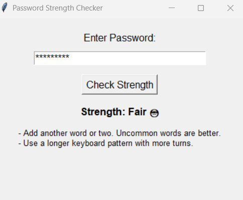

# 🔐 Password Strength Checker – GUI with Tkinter

This project is a simple and interactive **password strength checker** built using **Python and Tkinter**, with the power of the `zxcvbn` library by Dropbox. It evaluates the strength of a password in real-time and provides useful suggestions to make it stronger.

---

## 🎥 Demo


  


---


### 🔍 **Project Overview**

The **Password Strength Checker** is a desktop GUI application built using **Python’s Tkinter library**. It helps users understand how secure their passwords are by evaluating their strength and offering actionable suggestions for improvement.

This project is ideal for:

* Cybersecurity students exploring **password security**
* Beginners learning **GUI development in Python**
* Developers wanting to integrate real-time password analysis in apps

It uses **Dropbox's `zxcvbn` library**, a popular password strength estimator that simulates real-world password attacks and evaluates based on guessability.

---

### ⚙️ **How It Works**

1. **User Interface:**

   * Built using Tkinter (Python’s standard GUI library)
   * Contains:

     * Input field to enter a password
     * Button to analyze strength
     * Labels to show feedback and suggestions

2. **Password Analysis:**

   * When the user clicks "Check Strength", the entered password is passed to the `zxcvbn()` function.
   * The `zxcvbn` library analyzes the password using:

     * Known dictionary words
     * Common patterns (`123456`, `qwerty`, etc.)
     * Date strings (`2020`, `01/01/2000`)
     * Keyboard layouts
     * Substitutions (like `@` for `a`)

3. **Scoring System:**

   * The library returns a **score between 0 and 4**, mapped to labels like:

     * `0`: Very Weak 😟
     * `1`: Weak 😕
     * `2`: Fair 😐
     * `3`: Good 🙂
     * `4`: Strong 💪

4. **Feedback System:**

   * Along with the score, it gives a list of **suggestions** to improve the password, such as:

     * "Add another word"
     * "Avoid common patterns like '123'"
     * "Use uncommon words"

5. **Real-Time Visual Feedback:**

   * The score and feedback are shown instantly in the GUI
   * Emojis make the result more intuitive and engaging

---

### 🧠 Example in Action

**Password entered:** `devika123`
**Score:** Weak 😕
**Suggestions:**

* Avoid sequences like "123"
* Add more uncommon words to make it longer and less predictable

---

### 📁 Project Structure

```
📁 password-strength-checker
│
├── pass.py              # 🔑 Main GUI-based Python script
├── Review.png           # 🖼️ Screenshot or demo image of the app
├── requirements.txt     # 📦 Dependencies (e.g., zxcvbn)
└── README.md            # 📘 Project documentation
```


### 🛠 Installation

To set up and run this project locally, follow the steps below:

1. **Clone the Repository**

```bash
git clone https://github.com/SailudevikaMatta/Password-Strength-Checker
cd Password-Strength-Checker
```

2. **Install Dependencies**

Make sure you have Python installed (preferably Python 3.6+). Then install the required libraries using:

```bash
pip install -r requirements.txt
```

> 💡 If `zxcvbn` doesn’t install correctly, try:

```bash
pip install zxcvbn
```

3. **Run the Application**

```bash
python pass.py
```

The Tkinter window will open, and you can begin testing password strength!

---

### 📄 License

This project is licensed under the **MIT License**.


---
## 🙌 Acknowledgments

- [zxcvbn](https://github.com/dropbox/zxcvbn) for providing a powerful password strength estimator.
- [Tkinter](https://docs.python.org/3/library/tkinter.html) for building the desktop GUI.
- [Python](https://www.python.org/) for being beginner-friendly and versatile.
- [GitHub](https://github.com/) for version control and project hosting.
- [GitHub Actions](https://github.com/features/actions) for potential CI/CD automation.


